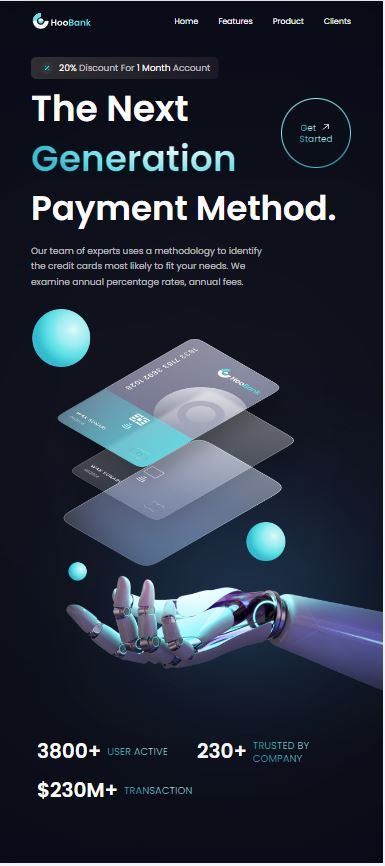
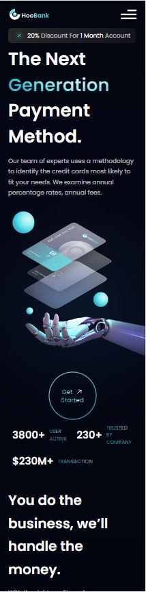
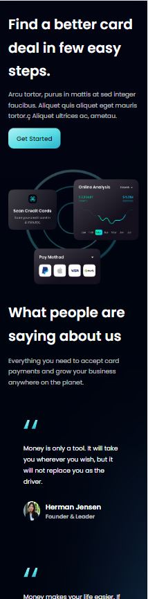
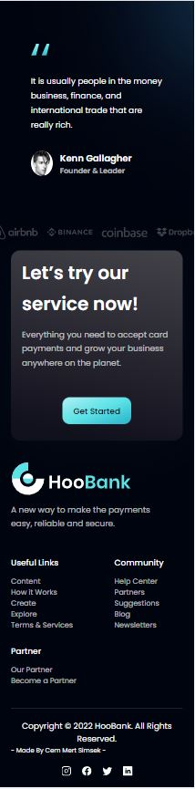

# HooBank

This is a fictional, modern UI/UX bank concept web application called ***HooBank*** from a Figma [*Design*](https://www.figma.com/file/bUGIPys15E78w9bs1l4tgS/HooBank?t=4tuo78D1jRAQL4Sj-0). It contains;

- Navbar | Landing Page with HQ images | Bussiness Stats
 Reusable Feature Sections | CTA Buttons | Testimonials | Clients | Footer |

##### Click the link to see full version of [deployed website.](https://bank-app-cemmertsimsek.vercel.app/)
Also you can click https://bank-app-cemmertsimsek.vercel.app/

## Aim of this project
Creating a Full **Responsive**, **Front-End**, **React** app while using and practising 3th party tools **Tailwind.css** Also using **Vite** for the first time. 

- #### <ins>What Main Steps Included?
    - **React.JS** Project Architecture
    - Fundamental **CSS Properties**
    - **Flex**
    - **Tailwind** CSS
    - Complex **Gradients**
    - **Media Querries**

- #### <ins>What Practiced?
    - **Arranging the files**
    - Creating **functional components**
    - **Using hooks** & writing **clean code**
    - Tailwind CSS **classes** 
        
- #### <ins>Dependencies

    - **React**
    - **Tailwind CSS**
    - **Vite**

##### Visuals

- on Large screen

 

 

- on Tablet screen

 

 

- on Mobile screen

   

##### Click the link to see full version of [deployed website.](https://bank-app-cemmertsimsek.vercel.app/)

Cem Mert Şimşek - 2022